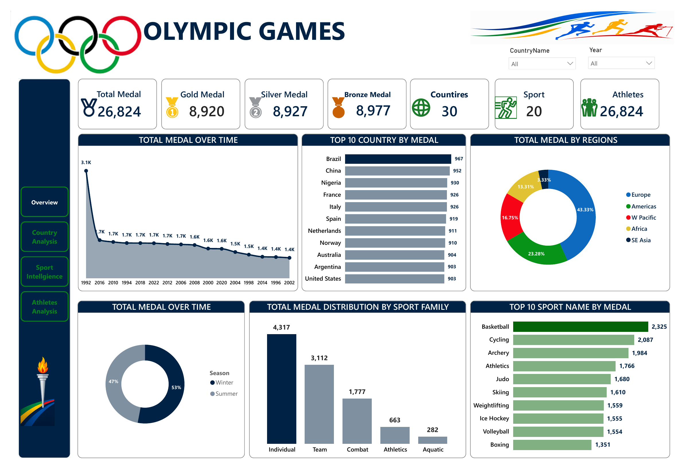
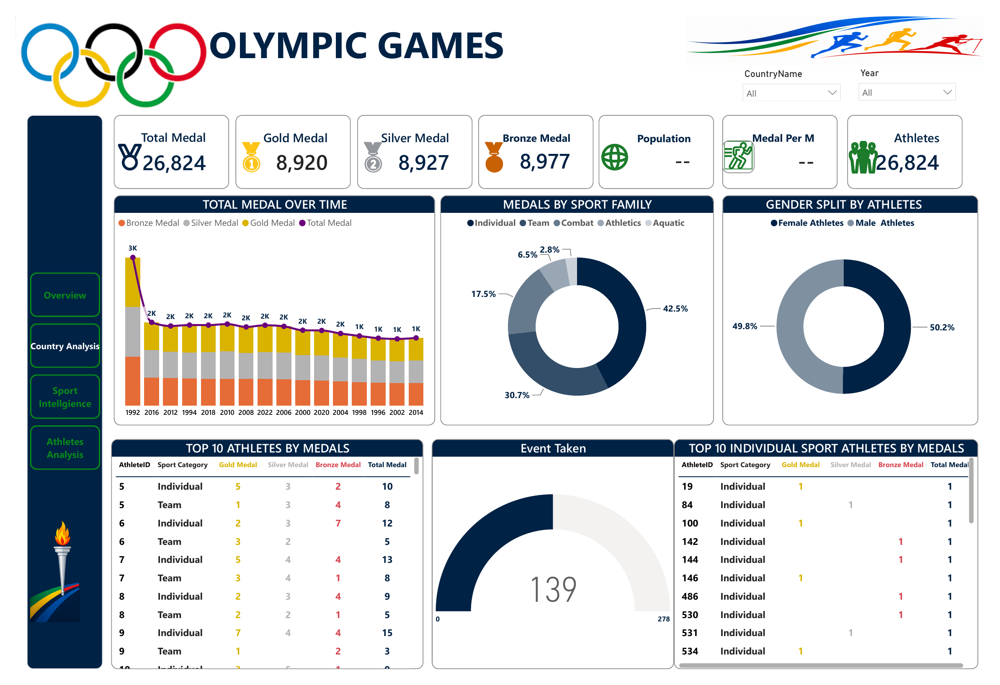
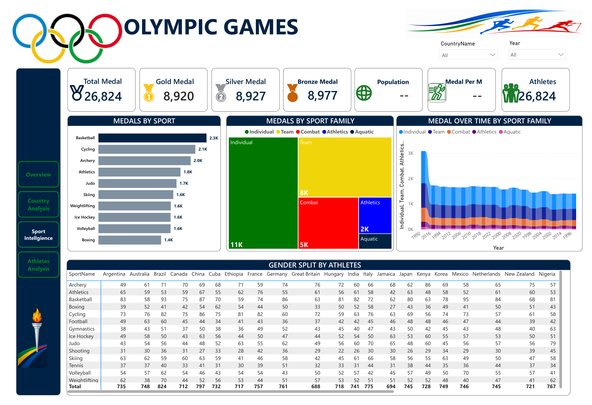
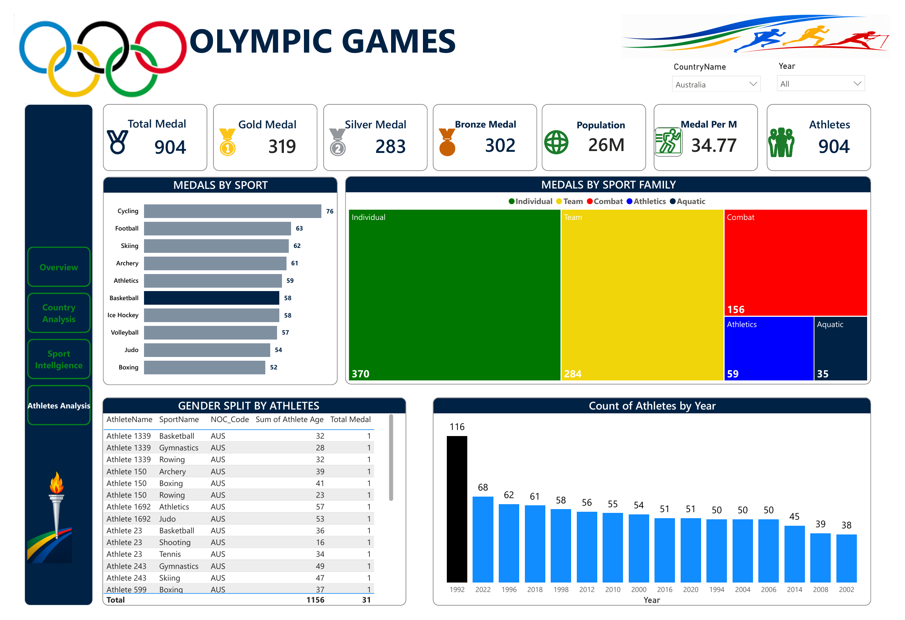

# Olympic Games Analytics Dashboard
 
**A Power BI dashboard exploring medal performance, country rankings, sport trends, and athlete statistics across the Olympic Games.**
 
Tool: **Power BI Desktop**
 
---
 
## 📌 Project Overview
 
This project analyzes historical Olympic Games data to uncover trends in medal distribution across countries, regions, sports, and athletes. Built in **Power BI**, the dashboard turns raw event and medal records into an interactive tool for exploring **who wins, what they win, and how performance has changed over time**.
 
The report supports global filtering by **Country** and **Year**, letting users drill from a worldwide overview down to a single nation's performance across every Olympic cycle.
 
---
 
## 🎯 Objectives
 
- Determine total medal counts (gold, silver, bronze) and how they are distributed globally
- Identify the top-performing countries and regions by total medals won
- Track how medal counts have trended over time across Olympic Games years
- Break down medal distribution by sport and by sport family (Individual, Team, Combat, Athletics, Aquatic)
- Compare performance across Summer and Winter seasons
- Analyze gender split among competing athletes
- Identify top-performing individual athletes by medal count
- Enable country-level drill-down, including medals per million population
---
 
## 🗂 Dashboard Structure
 
The report is a 4-page interactive Power BI dashboard:
 
| Page | Description |
|------|-------------|
| **1. Overview** | Headline KPIs, medal trends over time, top 10 countries, medals by region, season split, and medals by sport family |
| **2. Country Analysis** | Country-level medal trends over time, medals by sport family, gender split among athletes, and top athlete leaderboards |
| **3. Sport Intelligence** | Medal breakdowns by sport and sport family, medal trends over time by sport family, and a gender-by-country-by-sport matrix |
| **4. Athletes Analysis** | Country-filtered deep dive — medals by sport and sport family, athlete-level medal detail, and athlete counts by year (shown here filtered to Australia) |
 
All pages support global **Country Name** and **Year** filters.
 
---
 
## 📊 Key Metrics (KPIs)
 
| Metric | Value |
|--------|-------|
| Total Medals | 26,824 |
| Gold Medals | 8,920 |
| Silver Medals | 8,927 |
| Bronze Medals | 8,977 |
| Countries | 30 |
| Sports | 20 |
| Athletes | 26,824 |
 
---
 
## 🔍 Key Findings
 
**Country & Regional Performance**
- **Brazil** leads all countries with 967 total medals, closely followed by **China** (952) and **Nigeria** (930)
- The top 10 countries are tightly clustered, all within roughly 65 medals of each other — indicating strong competitive parity at the top
- **Europe** dominates medal share by region at **43.33%**, followed by the **Americas (23.28%)** and the **Western Pacific (16.75%)**
- **SE Asia** accounts for the smallest regional share at just **3.33%**
**Trends Over Time**
- Total medals awarded peaked early (3.1K in the earliest year shown) and have since stabilized in the 1.4K–1.7K range per Games
- Medal counts by year show a gradual downward trend before leveling off in more recent cycles
**Sport & Season Breakdown**
- **Summer Games** account for the majority of medals (53%) versus **Winter Games** (47%)
- **Individual sports** generate the most medals overall (4,317), followed by **Team sports** (3,112), **Combat sports** (1,777), **Athletics** (663), and **Aquatic** (282)
- **Basketball** is the single highest medal-producing sport (2,325 medals), ahead of **Cycling** (2,087) and **Archery** (1,984)
**Athletes**
- The athlete gender split is nearly even: **50.2% male** vs. **49.8% female**
- Top individual athletes have won as many as **15 total medals** across Individual and Team events combined
- Country-level drill-down (e.g., Australia) shows detailed per-athlete, per-sport medal breakdowns alongside a "Medal Per Million population" metric — useful for comparing performance relative to country size
---
 
## 💡 Potential Applications
 
1. **Federation & sponsor strategy** — identify which sports and regions are gaining or losing medal share over time to guide investment
2. **Talent scouting** — use top-athlete and per-sport leaderboards to study which countries or sports are producing the most decorated competitors
3. **Population-adjusted performance** — the "Medal Per Million" metric supports fairer country-to-country comparisons regardless of population size
4. **Season strategy** — compare Summer vs. Winter Games performance to identify where a country is over- or under-performing
5. **Gender parity tracking** — monitor the athlete gender split over time and by sport to support equity initiatives
---
 
## 🛠 Tools & Skills Used
 
- **Power BI Desktop** — data modeling, DAX measures, report design
- **DAX** — medal totals, medals-per-million, and trend calculations
- **Data Visualization** — KPI cards, line charts, bar charts, donut charts, treemaps, stacked area charts, and matrix tables
- **Interactive Filtering** — Country Name and Year slicers with page-level drill-down
---
 
## 📁 Repository Contents
 
```
├── Olympic_Games_Dashboard.pbix     # Power BI source file
├── Olympic_Games_Dashboard.pdf      # Exported PDF walkthrough of the dashboard
├── 01-overview.png                  # Dashboard screenshot — Overview
├── 02-country-analysis.png          # Dashboard screenshot — Country Analysis
├── 03-sport-intelligence.png        # Dashboard screenshot — Sport Intelligence
├── 04-athletes-analysis.png         # Dashboard screenshot — Athletes Analysis
└── README.md                        # Project documentation (this file)
```
 
---
 
## 📷 Dashboard Preview
 
### Page 1 — Overview

 
### Page 2 — Country Analysis

 
### Page 3 — Sport Intelligence

 
### Page 4 — Athletes Analysis

 
---
 
## 📬 Contact
 
**Olympic Games Analytics Project**
